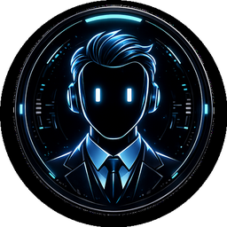

<p align="center">
  
</p>

<h1 align="center">HARVIS</h1>
<p align="center"><b>An open, hackable, voice-first AI butler for your Windows PC</b><br>
by <a href="https://kloomstudio.com.ar">KloomStudio.com.ar</a></p>

---

HARVIS is a JARVIS-style voice assistant that actually **does things on your PC**: opens apps, reads your Microsoft Teams, drafts WhatsApp messages by contact name, sets timers, takes a screenshot and *sees* it, checks your homelab over SSH, and talks back with natural streaming TTS — all hands-free, powered by the LLM of your choice.

*(The assistant speaks Spanish out of the box — prompts and voice are fully configurable in `config.yaml`.)*

## Features

- **Multi-brain**: Claude (Agent SDK), Groq/Llama, Ollama (local), OpenAI, Gemini, Kimi — switch by voice: *"Harvis, cambiá el cerebro a groq"*. Every brain gets the same tools.
- **Wake word without cloud**: Whisper (faster-whisper, GPU) + phonetic regex + fuzzy matching + **your own voice fingerprint** (record 6 takes with `grabar_harvis.py`; MFCC+DTW acoustic matching rescues the wake word even when Whisper mangles it).
- **Real tools**: windows/apps, media keys, weather, timers & alarms, browser, screenshots with vision, WhatsApp (draft-then-confirm, never sends alone), Microsoft Teams desktop reading, read-only SSH homelab, Obsidian-style vault search/notes, persistent memory that survives restarts.
- **Modes**: follow-up window (Alexa-style), *modo charla* (free conversation), *modo redactor* (free unlimited dictation → paste anywhere), *modo coach* (a confrontational ontological coach with its own brain and session diary).
- **Skills**: drop a `.py` in `skills/` (or install from the HUD) and HARVIS gains tools, prompt context and background **watchers** — this is where the community comes in.
- **HUD**: floating always-on-top orb → panel with live-streaming chat, brain selector, timers, skills manager (edit voice commands and even the wake word), privacy toggle, new-conversation and abort buttons.
- **Proactive**: morning briefing (weather + pending + Teams), nightly self-reflection (it updates its own memory of you), homelab watcher that warns when a container dies.
- **Interruptible**: F9 or ⏹ shuts it up and aborts the turn instantly.
- **Telegram channel**: talk to it from your phone; single-owner pairing.
- **Observability**: every turn is traced to `turnos.jsonl` (command → brain → each tool call with duration → reply). When something fails, you read *why* instead of guessing.

## Requirements

- Windows 11 (uses win32 APIs, WASAPI, UI Automation)
- Python 3.12+
- A microphone
- NVIDIA GPU recommended (Whisper large-v3; falls back to CPU/medium)
- At least one LLM: a [Claude](https://claude.com) subscription/API, a free [Groq](https://groq.com) key, or local [Ollama](https://ollama.com)

## Install

```bat
git clone https://github.com/<you>/harvis
cd harvis
python -m venv .venv
.venv\Scripts\pip install -r requirements.txt
```

API keys go in **environment variables**, never in files:

```bat
setx GROQ_API_KEY gsk_...
setx TELEGRAM_BOT_TOKEN 123:abc   (optional)
```

Run:

```bat
kloom.cmd
```

Say **"Harvis"** — it answers *"¿Señor?"* — then speak your command. Or click the orb and type.

### Teach it your voice (recommended)

```bat
.venv\Scripts\python.exe grabar_harvis.py
```

Six takes of you saying "Harvis". It auto-calibrates a threshold and from then on the wake word also matches on **sound**, not just Whisper's transcript.

## Configuration

Everything lives in [`config.yaml`](config.yaml): wake word and aliases, VAD pauses, TTS voice, brains and models, morning briefing hour, and per-tool settings (homelab SSH host, vault path, projects dir — empty = tool disabled, HARVIS will politely say so).

## Write a skill

A skill is one Python file in `skills/`. Full guide: [SKILLS.md](SKILLS.md).

```python
"""My skill: what it does (first line shows in the HUD)."""
from registry import kloom_tool

PROMPT = "Context the LLM gets about this skill."

@kloom_tool("my_tool", "What the LLM reads to decide when to call it.",
            {"param": str, "optional": (str, "default")})
async def my_tool(args):
    return "result the assistant speaks"

TOOLS = [my_tool]

async def WATCHER(avisar, cfg):     # optional: background loop
    ...
    await avisar("Sir, something happened.")
```

Install via the HUD (**SKILLS → + Instalar skill**) — it hot-reloads, no restart. Pull requests with new skills are very welcome.

## Architecture

```
oido.py      mic, VAD, push-to-talk, self-healing audio stream
stt.py       faster-whisper + anti-hallucination filters + wake protections
huella.py    acoustic wake-word fingerprint (MFCC + DTW, zero deps)
kloom.py     orchestrator: wake → modes → brain → voice
cerebro.py   brain factory + Claude Agent SDK driver
cerebro_jarvis.py  OpenAI-compatible driver (Groq/Ollama/OpenAI/Gemini/Kimi)
registry.py  canonical Tool format — tools never import a vendor SDK
boca.py      streaming Edge-TTS pipeline (speaks while still thinking)
hud.py       pywebview floating HUD
skills/      community-extensible skills (tools + prompt + watchers)
tools/       built-in toolset
trazas.py    per-turn observability (turnos.jsonl)
```

## Privacy

- Everything runs on **your** machine; audio never leaves it (Whisper is local). Only the text of your commands goes to the LLM you configured.
- `privacy.log_all_speech` and `save_wake_audio` are **off** by default in this repo.
- The voice fingerprint dataset (`dataset/`) and all runtime logs are gitignored.

## License

[MIT](LICENSE) — © KloomStudio · [kloomstudio.com.ar](https://kloomstudio.com.ar)

---

<details>
<summary><b>README en español</b></summary>

HARVIS es un mayordomo por voz estilo JARVIS que **hace cosas de verdad** en tu PC con Windows: abre apps, te lee Teams, redacta WhatsApps por nombre de contacto, pone timers, saca una captura y la *ve*, consulta tu homelab por SSH y te contesta con voz natural en streaming — con el modelo de IA que elijas (Claude, Groq, Ollama local, OpenAI, Gemini, Kimi).

**Instalar**: cloná el repo, `python -m venv .venv`, `pip install -r requirements.txt`, keys por variables de entorno (`setx GROQ_API_KEY ...`), y corré `kloom.cmd`. Decí **"Harvis"** y dale órdenes.

**Enseñale tu voz**: `grabar_harvis.py` graba 6 tomas tuyas diciendo "Harvis" y calibra una huella acústica — el wake word funciona aunque Whisper escriba cualquier cosa.

**Skills de la comunidad**: un archivo `.py` en `skills/` suma herramientas, contexto y vigías de fondo. Guía completa en [SKILLS.md](SKILLS.md). Se instalan desde el HUD sin reiniciar.

Todo corre en tu máquina: el audio nunca sale de tu PC.

</details>
